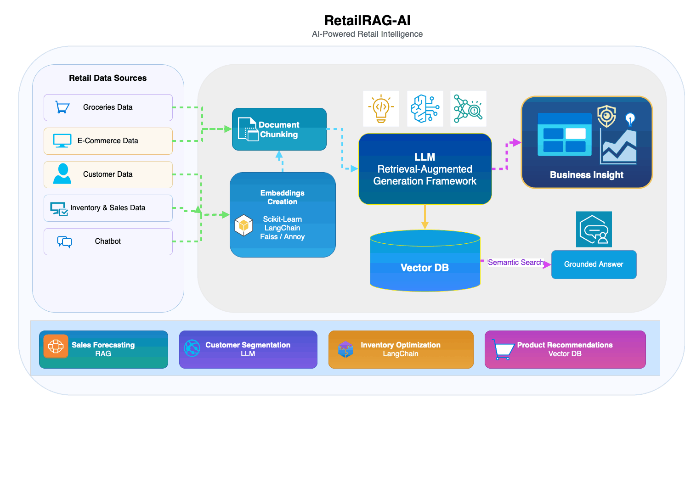
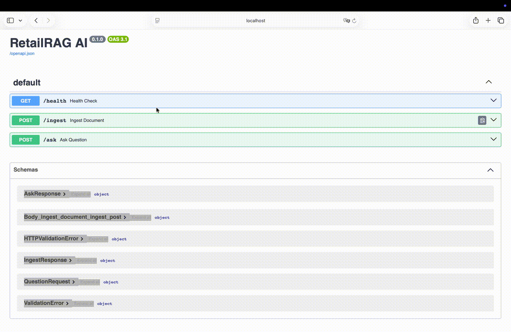

#  RetailRAG-AI

RetailRAG-AI is an end-to-end AI-powered knowledge assistant designed to answer user queries based on ingested documents using a Retrieval-Augmented Generation (RAG) pipeline. The system processes text data by splitting it into chunks, generating embeddings, and storing them in a vector database (ChromaDB) for efficient retrieval. When a user submits a query, relevant context is fetched and passed to a locally hosted LLM via Ollama to generate accurate, context-aware responses. Built with FastAPI and modular services, the project demonstrates practical integration of data pipelines, vector search, and generative AI for real-world applications such as document intelligence and enterprise search.

---

##  Key Features

-  Document ingestion using `.txt` files  
-  Text chunking for efficient retrieval  
-  Embedding generation with Ollama  
-  Vector storage using ChromaDB  
-  Context retrieval pipeline  
-  LLM-based grounded answer generation  
-  FastAPI endpoints for Q&A and ingestion  
-  Logging for observability  
-  Docker support for deployment  

---

##  Why Choose

- Combines **RAG + LLM + Backend APIs** in a production-ready pipeline  
- Uses **local LLM (Ollama)** → no external dependency  
- Scalable modular architecture  
- Real-world use case: knowledge assistant / document QA system  
- Strong demonstration of **GenAI + Data Engineering skills**  

---

##  System Architecture

```text
Documents
   ↓
Loader
   ↓
Chunking
   ↓
Embeddings
   ↓
Chroma Vector Store
   ↓
Retriever
   ↓
Prompt Builder
   ↓
Ollama
   ↓
Answer with Sources
```
<p align="center">
  
</p>
---

##  Demo

<!-- Add your demo GIF here -->
<p align="center">
  
</p>

---

## ⚡ Quick Start

### Install dependencies

```bash
pip install -r requirements.txt
```

### Run the API

```bash
uvicorn app.main:app --reload
```

### Open Swagger UI

http://127.0.0.1:8000/docs

---

##  Simple Example

### Ask a Question

```bash
POST /ask
```

```json
{
  "question": "What is the refund policy?"
}
```

### Response

```json
{
  "answer": "The refund policy allows returns within 30 days...",
  "sources": ["document1.txt"]
}
```

---

##  Project Structure

```bash
retailrag-ai/
│
├── Dockerfile
├── README.md
├── app
│   ├── main.py
│   ├── models
│   │   ├── request_model.py
│   │   └── response_model.py
│   ├── services
│   │   ├── chunk_service.py
│   │   ├── embedding_service.py
│   │   ├── llm_service.py
│   │   ├── loader_service.py
│   │   ├── prompt_service.py
│   │   ├── retrieval_service.py
│   │   ├── script.ipynb
│   │   └── vectorstore
│   │       ├── chroma.sqlite3
│   │       └── ea7fcfb0-8be3-4bba-b138-d02a210dcbac
│   │           ├── data_level0.bin
│   │           ├── header.bin
│   │           ├── length.bin
│   │           └── link_lists.bin
│   └── utils
│       └── logger.py
├── data
│   └── docs
│       ├── refund_policy.txt
│       ├── shipping_policy.txt
│       └── support_faq.txt
├── readme_docs
│   └── retailRAg.gif
├── requirements.txt
├── tests
└── vectorstore
    ├── 6e6de10a-6c7c-4211-a0d4-d5d0cb6fe82b
    │   ├── data_level0.bin
    │   ├── header.bin
    │   ├── length.bin
    │   └── link_lists.bin
    └── chroma.sqlite3
```

---

##  API Endpoints

### Health Check
```
GET /health
```

### Ask Question
```
POST /ask
```

### Ingest Documents
```
POST /ingest
```

---

## ⚙️ How It Works

1. Load documents from `data/docs`  
2. Split into chunks  
3. Generate embeddings  
4. Store in ChromaDB  
5. Retrieve relevant chunks  
6. Build prompt  
7. Generate answer using Ollama  

---

##  Tech Stack

- Python  
- FastAPI  
- LangChain  
- ChromaDB  
- Ollama  
- Pydantic  
- Docker  

---

##  Future Improvements

- 📄 PDF and Markdown ingestion  
- 🏷️ Source metadata in responses  
- 🔀 Hybrid retrieval  
- ⚡ Reranking  
- 💬 Chat memory  
- 📊 Evaluation pipeline  
- 📚 Multi-document filtering  

---

##  Contact

**Chandrayee Kumar**  
Python Developer | AI/ML Engineer | Data Systems Enthusiast
